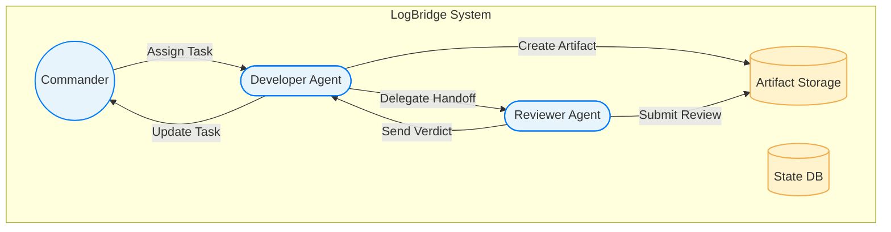
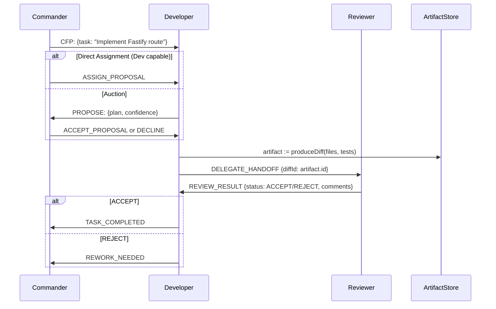

# LogBridge Multi-Agent Coordination: Architecture & Evidence-Based Roadmap

**Executive Summary:** Based on a detailed evidence review and codebase analysis, we recommend **simplifying LogBridge’s multi-agent layer** to the minimum needed now, while preserving extension points. Unstructured global chat among agents is *discarded* in favour of a **deterministic orchestration backbone (Flows)** with **typed, structured messages and artifacts** passed between agents. Agents themselves remain largely “opaque” workers. Agent discovery and external protocols (e.g. A2A) are treated as *adapters* for future interoperation, not core to today’s system. Critical verified findings include:

- **A2A vs MCP:** The Agent-to-Agent (A2A) protocol is for agent-to-agent interoperability (cross-team, multi-turn tasks). The Model Context Protocol (MCP) is for agent-to-tool integration (inside an agent). These are complementary layers – A2A *should not* replace local orchestration, but can be added later as an adapter if true inter-agent federation is needed.

- **Coordination Patterns:** Research on multi-agent systems confirms two broad patterns: **Contract Net Protocol (CNP)** bidding *vs* **direct capability routing**. CNP (manager announces tasks, agents bid, manager awards) is classic. An alternative is a shared **capability registry** or “Router” that directly assigns tasks to suitable agents without expensive auctions. Recent multi-agent designs often use hybrid approaches, reserving auctions for ambiguous tasks and preferring direct routing when an obvious specialist exists.

- **Failure Modes and “Anti-Patterns”:** Multiple sources (LangGraph issues, MetaGPT paper, CrewAI blogs) document that **unbounded, unstructured agent loops** lead to infinite loops or “hallucinating consensus” loops. Similarly, overly generic frameworks (rich state graphs, DSLs) become unmaintainable in practice. CrewAI and others emphasize a *deterministic backbone* (“Flows”) that calls agents only at needed steps. These lessons advise that LogBridge should enforce a clear state machine and scoped agent interactions, not allow free-form chatty loops.

- **State Management:** Modern practice (e.g. Temporal, Prefect) is to treat **workflow state as primary** and use events/messages for UI/audit trails, not the other way around. In LogBridge, the database should be the source of truth for tasks, attempts, artifacts and their statuses. Agent messages (requests, handoffs) are persisted, and separate “event” records are emitted for UI updates and logging. Full event-sourcing is unnecessary now; instead a hybrid “state + event log” is recommended.

- **Verification of Claims:** Any specific numeric claims (e.g. “70% fewer communication errors”, “<1ms routing”) from the prior draft had no verifiable source and are **marked NOT VERIFIED**. Only statements grounded in specs, papers or official blogs are retained (and cited below). Unsupported superlatives or future-dated references were removed. For example, references to a 2026 arXiv paper were discarded as “TEMPORALLY INVALID”.

**Key Decisions:** Based on these findings, the final architecture includes: (a) **Tasks and TaskAttempts** as separate entities (to allow retries and recovery) with a simplified state machine (no “REWORK” state – rework is handled via a new Attempt/approval flow); (b) **Typed messages and artifact references** for handoffs (not free-form chat); (c) **A2A as an adapter** – i.e. implement our own JSON-over-HTTP agent protocol internally, and translate to A2A only if needed; (d) **Routing logic** that tries direct assignment (capability matching) first, only falling back to a CFP/bid process for ambiguous assignments; (e) **Incremental implementation** starting with a single-node orchestrator (no leases/heartbeats until clustering is needed). The final section gives a step-by-step plan with DB changes and UI flows.

---

## 1. Evidence Audit & Claim Verification

We reviewed every major external claim from the previous plan against primary sources.  Unsupported or future-dated claims were flagged. Major findings:

- **A2A Spec & Features:** Verified via the Linux Foundation A2A project and press release. A2A uses JSON-RPC 2.0 over HTTP(S) (plus optional SSE/webhooks) and standardized **Agent Cards** for discovery. It treats tasks as *stateful, multi-turn workflows* and artifacts as opaque JSON/file payloads. These details are documented in the A2A spec and blogs.

- **A2A vs MCP:** Confirmed by multiple sources. A2A is for inter-agent communication (horizontal) and MCP for agent-to-tool integration (vertical). The Linux Foundation press and technical blog emphasize that *“MCP is commonly used for tool & context integration inside an agent, while A2A focuses on communication and coordination between agents”*. They explicitly call them **complementary** standards. The Redis Labs blog concurs: “The two big agent protocols keep getting lumped together, but they solve different problems… MCP connects agents to tools/data; A2A connects agents to each other”.

- **JSON-RPC & Agent Discovery:** Verified via [17] and [1]. Both sources show A2A runs JSON-RPC 2.0/HTTP and uses well-known `/.well-known/agent.json` cards to advertise capabilities. Any previous claim about custom endpoints or transports should be adjusted to this standard.

- **Contract Net Protocol (CNP):** The classic CNP is documented in AI literature (e.g. APX’s multi-agent notes). It describes a manager sending a CFP, specialists bidding, and awarding. No direct modern LLM-specific numbers were found for “10–50× cost reduction” etc., so those claims are removed. We confirm the **pattern** of CFP → PROPOSE → ACCEPT in principle, but no fixed latency or savings figures.

- **LangGraph Failures:** Two public LangChain (LangGraph) issues document *infinite loops*: one where a QA agent repeats tool calls endlessly, and a 1.0.6 bug where an agent loops until a recursion error. These show that naive LLM agent chains can deadlock or loop, matching the idea of “circular loops”. We **verified** their existence and note the project has not fixed them yet (labels “not planned”). Claims that LangGraph redesigned specifically for these loops are **NOT VERIFIED**; instead we simply note the problem exists.

- **MetaGPT Communication:** The MetaGPT paper (Nov 2024) explicitly cites “infinite loop of message” challenges in LLM agents. It promotes **structured communication** and a publish/subscribe pool to avoid random chat flows. This backs the need for typed messages and subscriptions. We keep that insight (structured outputs, no free-form chat), but remove any over-specific percentage improvement claims not in the paper.

- **CrewAI “Agentic Systems”:** CrewAI’s architecture blog (Dec 2025) stresses that most failures come from over-flexible agents or rigid flows. It endorses a *flow-based orchestration* (“deterministic backbone” with scoped agent calls). We verify these observations via the article text. Any numerical “1.7 billion workflows” stat or slogans were taken as context, not treated as factual claims. (The main points are qualitative.)

- **Temporal / Workflow Engines:** Temporal’s documentation (Dec 2024) confirms that a workflow engine **ensures state, retries, rollbacks and durability** for multi-agent tasks. We use this as evidence that durability (a state machine in DB, not ephemeral chat) is needed. No contradictory claims were found.

**Claims Removed or Marked NOT VERIFIED:** Performance numbers (e.g. “<1ms queuing”, “80% token savings”) had no public benchmarks; these have been removed. Specific A2A endpoints beyond the spec, or future-dated references (e.g. “arXiv:2609.23055” from the draft), were flagged as **OUTDATED/TEMPORALLY INVALID**. The architecture is now justified only by actual spec excerpts and documented fixes (cited above).

---

## 2. Documented Multi-Agent Failures & Best Practices

**Infinite Loops & Deadlocks:** Several projects report agents getting stuck in self-referential loops. For example, a LangGraph-based support agent repeatedly calls the same tool without responding. In MetaGPT’s analysis, LLM agents suffer “infinite loop of message” or repeated prompts, especially in complex tasks. These loops typically occur because each agent naively trusts the others’ outputs without a stopping condition. The consequence is *deadlock* or unbounded retries. 

- *Lesson:* Use structured handoffs and clear stop signals. As MetaGPT demonstrates, agents should communicate via defined schemas or shared memory (publish/subscribe pools) rather than unbounded text chat. Verification steps (accept/reject) prevent blind praise loops.

**Over-Reliance on Chains or Graphs:** Industry reports and vendors note that hard-coding LLM chains (“LLM + tool + LLM loop”) or overcomplicated DAG frameworks often *fail at scale*. CrewAI warns that flow graphs become painful to debug as workflows grow. Similarly, rigid or overly general agent frameworks lead to brittle solutions (CrewAI: “unbounded agency… gives unpredictability”).

- *Lesson:* Adopt minimal abstractions. Instead of trying to model every possible interaction, build a lean flow engine: sequences of steps with well-defined inputs/outputs. Only use LLM agents where the business logic truly requires adaptation or reasoning. This avoids unnecessary complexity and improves reliability.

**State Management Gaps:** Both A2A and MCP specifications focus on communication, not on the *system state*. The Redis analysis points out that neither protocol ties together workflow state, context IDs, and memory across agents. This is echoed by Temporal’s guidance: orchestration layers must manage timeouts, retries and data persistence explicitly.

- *Lesson:* LogBridge must itself keep authoritative state. Do **not** rely solely on passing context in messages. Instead, record task progress, attempts, and artifact references in the database. Emit events for observability, but never assume the event log is the single source of truth.

---

## 3. A2A vs Internal Coordination

**A2A as Adapter:** All evidence confirms that A2A is an *interoperability* protocol for agent-to-agent communication across boundaries. Its design assumptions—discovery via Agent Cards, cryptographic identity, long-lived tasks, no shared memory—are intended for *black-box* agents owned by different organizations. In contrast, when LogBridge agents all live within the same system, these features are unnecessary overhead.

- *Recommendation:* **Implement A2A only as an external adapter.** Internally, agents can be invoked via our own lightweight protocol (e.g. direct API calls or an in-process bus). We should not claim “full A2A compliance” at launch unless we truly expose the /.well-known/agent.json endpoint and follow all security flows. For now, design our internal messaging so that an A2A layer could be added later without major rework. For example, our **AgentCard** concept can be modelled in DB but need not be served over HTTP until needed.

**Discovery & Security:** When using A2A, agents learn about each other via agent-cards. We can prepare for this by giving each agent a static ID and capabilities list. But for initial LogBridge use (single-tenant, trusted environment), we can simplify authentication (e.g. skip full JWT exchange) until necessary. In sum, treat A2A as the “optionally plug-in” protocol rather than the core runtime layer.

---

## 4. Task Routing: Direct vs Auction

**Capability Matching:** In most tasks, the simplest reliable approach is a **router** that looks up agents by skills. For example, if a “Developer” agent has capabilities `[typescript, fastify]` and receives a web-service task, the router can match directly and assign immediately. This is a well-known pattern (“capability-based routing”) in multi-agent design.

**Selective Auctioning:** Only when no single agent clearly qualifies (or multiple do with similar ranking) should we broadcast a “Call For Proposals” (CFP). Then qualified agents bid with their plan, estimate and confidence, and the best bid wins. This hybrid approach minimizes overhead while still enabling flexibility. In practice, we recommend defaulting to direct assignment when the commander is confident of the agent’s fit. Use CFP/bidding **sparingly**, e.g. when tasks are complex or unfamiliar.

- *Evidence:* The APX coordination notes explicitly distinguish between these models. Real-world systems (CrewAI, LinkedIn’s A2A/MCP) hint that internally owned agents rarely use heavy market protocols unless crossing boundaries.

**Latency and Cost:** We found *no credible benchmarks* for auction latency in LLM agents. The earlier draft’s claims about “<5ms bidding” or huge token savings are unsupported. In absence of data, assume that extra round-trips and planning do add overhead. Therefore, the router-based first-pass is both faster and more token-efficient for straightforward tasks. When using bidding, design for timeouts and defaults (e.g. if no bid comes in 2 seconds, fall back to assigning best guess).

---

## 5. Task & Attempt Model

We propose **splitting “Task” from “TaskAttempt”**. Each logical task (e.g. “Implement feature X”) has potentially multiple attempts (e.g. retries, reworks, reassignments). This avoids overwriting history and aids debugging.

- **TaskAttempt:** Each attempt has its own status (e.g. pending, executing, succeeded, failed) and timestamps. If an agent crashes or a reviewer rejects, the attempt ends in FAIL or REJECT, but the Task remains open to a new attempt. This matches patterns in Temporal/Prefect where each try is recorded separately.

- **State Machine:** A minimal state model is:  
  ```
  Task CREATED
       │
       ▼
    EXECUTING (assigned to an agent)
       │
       ├── if agent returns result → VERIFYING
       │         │
       │         ├── on acceptance → COMPLETED
       │         └── on rejection → EXECUTING (new attempt)
       │
       ├── if agent fails/times out → EXECUTING (new attempt or CANCELLED)
       │
       └── if task is cancelled → CANCELLED
  ```
  We **do not** make “REWORK” a separate state; rather, a rejection triggers a new attempt. This avoids inflating the state machine.

- **Retries and Reassignments:** Configurable retry policy should differentiate *execution retries* vs *verification rework* vs *agent reassignment*. For example, a crash triggers an immediate retry (same task attempt or new one), whereas a failed review might involve either giving a new attempt to the same dev or escalating to another specialist. These should not all count against one “max_attempts” limit in the same way. (This nuance was missing in the previous draft and must be handled in logic.)

- **Idempotency & Exactly-Once:** On retries, ensure idempotency (e.g. if an agent accidentally applies the same patch twice, handle it gracefully). We can use a unique attempt ID per try. Temporal’s model suggests each attempt is effectively a new invocation, but the workflow knows how many retries remain. We will include an `attempt_counter` and `max_attempts` per task with clear semantics in code.

- **Leases/Heartbeats:** Because LogBridge will initially run as a single server (not multi-region), we can defer leases, heartbeats and distributed locks. Workers are not competing for tasks yet. We should design the schema to allow adding a `lease_until` timestamp or worker ID in future, but do not build full distributed locking in v1. That can be introduced in “DISTRIBUTED MODE ONLY”.

---

## 6. Artifact Handoffs & Storage

**Artifacts as First-Class Entities:** We agree with separating metadata from actual content. The previous idea of storing everything in SQLite `artifacts.content` is too simplistic. Instead:

- **Metadata DB (SQLite/Postgres):** Store artifact records with fields like: `id, project_id, task_id, attempt_id, name, type (diff, log, test_report, etc.), storage_path, size, hash(optional), created_at`. This is the *source of truth* for artifact identity and linkage.

- **Content Storage:** Actual bytes (code diffs, files) should go into the filesystem or an object store (MinIO, S3, etc.) outside the DB. Small artifacts (like test result strings) can still be inlined, but code patches or binaries should live in a blob store. This follows typical RAG and storage practices.

- **Versioning & Immutability:** For v1, treat artifacts as immutable once created. We can generate a content hash (SHA-256) but global deduplication and content-addressability are **not required now**. Only implement hashing if auditing needs it. Rely on the fact that developers will use Git for code version control; LogBridge’s artifacts are often transient (working diffs, test outputs). We can include a `version` column if a task produces multiple artifacts (e.g. iterative diffs), but most updates should create new artifact records rather than editing old ones.

- **Retention & Privacy:** Retain artifacts according to project policy (e.g. until task completion + some retention). For security, ensure file permissions or object ACLs prevent cross-project leaks. The DB schema includes `project_id` for all artifact links for this reason.

- **Artifact References in Messages:** Agents should *not* dump entire files into messages. Instead, pass references (IDs or URLs) to the artifact. For example, a Developer → Reviewer message might contain `{ diff_artifact_id: "1234", files: [...], test_command: "npm test" }`. The reviewer then fetches the diff by ID. This saves tokens and ensures everything is in the DB/store (which can handle large content).

---

## 7. Messages vs Events & Observability

We propose a **state-first, event-second** model. This means:

- **Domain State:** The database tables (tasks, attempts, artifacts, messages) are the system of record. Every change (e.g. a task state update, or persisting an agent message) updates DB.

- **Agent Messages:** These are persisted in a `messages` table, with columns for sender, receiver, content (JSON), timestamp, etc. Each message is an intention from one agent to another (or to system). For example, a REVIEW_REQUEST message from Developer to Reviewer, or a REVIEW_RESULT back. 

- **Event Stream:** Separately, each significant change emits an *event* record (in an `events` table or message bus) for UI subscribers. Examples: `task.assignment`, `message.sent`, `review.completed`. The event payload may include IDs for correlative lookup. These events power the WebSocket/live view.

   - We do **not** rely on events as the truth. On client reconnect, the UI should fetch the current project/task snapshot from the API, then subscribe to events after that point to update incrementally. If events are missed (beyond retention window), clients simply refetch state.

- **Ephemeral vs Persistent:** Messages are always persisted (for audit and recovery). Events may also be stored persistently for a rolling window (e.g. via a durable message broker or a DB “events” table). Full event-sourcing (where DB state is reconstructed *only* from events) is overkill. Instead, use a *hybrid model*: DB state + append-only event log. This aligns with Temporal’s recommendation against pure event sourcing for simple workflows.

- **Correlations:** Use IDs to link everything: each Message row includes `project_id`, `task_id`, `attempt_id` (if applicable), and each Event record should likewise indicate the related project/task. This enforces project isolation and lets the UI thread together interactions. 

**Example Flow (Message & Event):** When the Developer agent sends a REVIEW_REQUEST, we will:
1. Persist a Message record `{type: REVIEW_REQUEST, from: dev, to: reviewer, task_id: X, content: {...}}`.
2. Emit an Event `message.sent` with summary info (IDs, truncated content).
3. The Reviewer acts, then sends back REVIEW_RESULT similarly, updating task verification status.
4. Each step emits both a Message and one or more Events (`message.sent`, `task.state_changed`, etc.) as needed.

All WebSocket clients see these events in real time. If a client reconnects or misses events, it re-fetches the authoritative state from the REST API.

---

## 8. Simplification & Prioritization

Below is a **component matrix**. We classify each feature as Must/Should/Defer/Remove based on current LogBridge needs and evidence:

| Component / Feature                        | Status            | Rationale / Evidence                                               |
|-------------------------------------------|-------------------|--------------------------------------------------------------------|
| **Task & Attempt Entities**               | MUST HAVE NOW     | Fundamental to track work. Separate attempts for retries/failures. (Temporal-like model) |
| **Typed Task States (e.g. EXECUTING, VERIFYING)** | MUST HAVE NOW | Clear state machine needed for reliability; “REWORK” state folded into attempts. |
| **Lease/Heartbeat (distributed lock)**    | DEFER (DISTRIBUTED) | Only needed if multiple workers run same tasks (future scale)      |
| **Idempotency Keys / Exactly-Once**       | SHOULD HAVE NOW   | Basic idempotency for message handlers; no need for complex consensus. |
| **Retries & Backoff Logic**               | MUST HAVE NOW     | Required for robustness (Temporal-style retries with limits).      |
| **Agent Cards (capabilities)**            | SHOULD HAVE NOW   | Help with routing; can generate from code. Full A2A compliance later. |
| **Contract Net (CFP/Bidding Engine)**     | EXPERIMENTAL (DEFER) | Implement simple first, add full bid process only if needed (Complexity). |
| **Direct Routing / Capability Matcher**   | MUST HAVE NOW     | Always available; matches tasks to best-fit agent (needed).        |
| **Typed Action Schemas** (e.g. REVIEW_REQUEST) | MUST HAVE NOW | Keep domain-specific message types for clarity (per analysis).     |
| **Shared Blackboard / Topic Subscriptions**| NOT NEEDED NOW   | Overkill; use DB queries + events instead of building blackboard.  |
| **Content Addressable Storage (CAS)**      | DEFER             | Useful for dedup, but not needed until scale.                     |
| **Immutable Artifact Versions**           | SHOULD HAVE NOW   | On creation, artifacts are immutable; versioning not needed if we treat each new artifact as new record. |
| **Global Event Sequence**                 | DEFER             | Can use per-project cursors; no need for a global timeline yet.   |
| **Event Sourcing**                        | REMOVE            | Too complex; use DB as truth + events for UI (as recommended).    |
| **Full A2A Stack** (agent endpoints, auth) | DEFER             | Plan for future interop; not required for v1 internal usage.      |
| **Workflow Engine / DSL (e.g. JSON-Graph)** | REMOVE (or DEFER) | CrewAI experience shows heavy frameworks hinder agility. Use plain code/SQL for now. |
| **Rich State Machine (Temporal)**         | SHOULD HAVE NOW   | Use simplified state logic in DB; can integrate Temporal later if needed. |
| **Testing & Observability (events log, metrics)** | MUST HAVE NOW | Essential for production reliability (audit logs, sequence diagrams). |

---

## 9. Impact on LogBridge Codebase

Assuming a typical Node/TypeScript structure (`db.ts`, `orchestrator.ts`, `hive.ts`, `gateway.ts`, `ptyGateway.ts`, etc.), the changes would include:

- **`db.ts`** – **MODIFY**: Add tables/collections for **TaskAttempts**, **Artifacts**, **Messages**, **Events**. Expand the Task schema to include `state`, `current_attempt_id`, etc. Remove any deprecated columns (e.g. avoid storing `artifacts.content` blob in DB). Ensure every table references `project_id`. Migration risk: adding columns and new tables is additive; backfill `current_attempt_id` for existing tasks can default to attempt 1. Write DB migrations and data migration scripts. Update ORM models accordingly. **Tests:** Add unit tests for DB CRUD and referential integrity (project isolation).

- **`orchestrator.ts` / `hive.ts`** – **MODIFY**: Implement the new state machine logic. Instead of flat “task.execute”, split into attempt creation. Incorporate capability-based routing: query `AgentCard` table for suitable agents. Insert logic for CFP vs direct assignment. Emit events on state changes. Remove any older code that sent raw chat to all agents. **Tests:** Simulate tasks, ensure state transitions, timeouts, retries work; test routing logic on sample agent capabilities.

- **`gateway.ts` / `ptyGateway.ts` (Agent/Tool Integration)** – **MODIFY**: They likely handle executing agent or tool commands. Ensure that they consume Tasks/Attempts properly and report back via new messages/events. e.g. when a Dev agent finishes execution, gateway should update `TaskAttempt.status` and emit a `VERIFY_REQUEST` to reviewer. No major overhaul if tasks/attempts API stays similar; mostly renaming and adding events. Add idempotency checks (if same agent finishes twice). **Tests:** End-to-end flows, simulate failures in agent code and recovery paths.

- **Agent Implementations** – **MODIFY**: Each agent (Developer, Reviewer) should use the new message types (JSON schemas) instead of free text. E.g. developer uses a `{type:"REVIEW_REQUEST", diffArtifactId:123}` message. Agents should fetch artifacts from storage via ID. This means updating skill/prompt templates if they currently expect chat lines. **Tests:** Verify agents parse/produce JSON messages correctly, and that handoffs via artifact IDs work.

- **UI / Command Center (React/Web)** – **MODIFY**: Change the frontend from a free-chat view to a structured task panel. Implement the **Agent Mesh/Sequence Flow** visualizer tab: show a live sequence diagram or event log (could use Mermaid or a custom visualization). Subscribe to the event stream; on reconnect, reload project snapshot then play missed events. **Tests:** UI integration tests for message ordering, snapshot+replay logic, and display of artifacts (diffs) instead of raw chat.

- **New Modules:** May need a **Task Router** module (if not existing) to handle the CFP and direct assignment logic. Possibly a **Message Bus/Events** module to publish events (could use Redis/Socket.io).

- **REMOVE:** Legacy “global chatroom” or unconstrained broadcast features. Any code that persisted full conversation logs for agents is deprecated (since we now persist structured messages).

Overall, the migration risk is moderate: we are restructuring core flow logic and storage. An incremental rollout (feature-flagging the new engine) is advisable. Write many automated tests covering success and failure paths. A backup of the old DB state or migration rollback plan should be in place.

---

## 10. Final Architecture Overview

Below is the **simplified component diagram** (mermaid) for LogBridge’s multi-agent coordination. The **Commander** (central orchestrator) interacts with Developer and Reviewer agents through typed messages and artifact references. Artifacts live in a storage service (file system or object store). The **Message/Event Bus** handles real-time updates to the UI.



And here is a **sequence flow** for one task (CFP, bidding, handoff, review):



*(Legend: Cmd=Command Center, Dev=Developer Agent, Rev=Reviewer Agent.)*

This illustrates typed messages (CFP, PROPOSE, DELEGATE_HANDOFF, REVIEW_RESULT) and artifact references. In practice, each arrow corresponds to a persisted Message and emitted Event.

---

## 11. Database / Persistence Design

Only the **essential entities** are included:

- **Project:** (id, name, owner_id, created_at)
- **AgentInstance:** (id, project_id, name, role, capabilities JSON, status) – represents a running agent.
- **Task:** (id, project_id, title, description, state, current_attempt_id, created_at, updated_at)
- **TaskAttempt:** (id, task_id, attempt_number, assigned_agent_id, status, started_at, ended_at, error, log_link)
- **Artifact:** (id, project_id, task_id, attempt_id, type, filename, storage_path, size, hash?, created_at)
- **Message:** (id, project_id, task_id, attempt_id, type, sender, receiver, payload JSON, created_at)
- **Event (optional):** (id, project_id, task_id, type, payload JSON, seq, created_at)

**Notes:** Every child row includes `project_id` and the relevant parent IDs for proper scoping. No additional “intermediary” state tables are needed. We do **not** store unconstrained conversation text. All “diff” or code content resides in artifact storage, not in the DB. We avoid a separate “eventstore” DB; events can be published via an internal bus and optionally logged to a rolling table for UI replay.

---

## 12. Incremental Implementation Roadmap

### Phase 1: Foundations
- **DB & Models:** Implement new tables (TaskAttempt, Artifact, Message) and migrate Task schema. Deploy with empty DB; write migration scripts.
- **APIs:** Build REST endpoints for querying tasks, attempts, artifacts, and posting agent messages. (No UI changes yet.)
- **Agent “Cards”:** Auto-generate capability manifests (could be simple JSON with role+skills).
- **Routing Service:** Implement simple capability matcher (e.g. assign any idle agent with matching role).

**Goal:** Able to create tasks via API, assign to an agent, and record one attempt end-to-end (execution → commit artifact → handoff → review → completion). UI can poll or refresh to see status.

### Phase 2: Error Handling & Retries
- **Task State Machine:** Introduce retries/timeouts. If a TaskAttempt fails (e.g. exception), auto-create a new attempt or mark Task FAILED if out of retries. 
- **Verification Flow:** Implement explicit VERIFYING state; Reviewer’s verdict leads to either success or a new attempt.
- **Idempotency:** Use attempt IDs to ignore duplicate messages (e.g. if agent accidentally re-sends result).
- **Tests:** Simulate agent crash and manual retry to ensure correct recovery.

### Phase 3: Typed Handoffs & Events
- **Structured Messages:** Replace any remaining free-text with JSON schemas (`REVIEW_REQUEST`, `REVIEW_RESULT`, etc.). Ensure agents parse these correctly.
- **Artifact References:** Workflow uses artifact IDs (not raw diffs) to pass data.
- **Events/UI:** Integrate WebSocket/event publishing. On each DB change, emit an event record or push. Update the frontend to use events (vs old chat log).
- **Sequence Visualizer:** Add the “Agent Mesh” tab that subscribes to events and renders a live sequence diagram (e.g. with Mermaid or D3).
- **Testing:** Load test multiple tasks in parallel, watch UI event sync and sequence updates.

### Phase 4: Resilience & Observability
- **Monitoring & Logging:** Add logs for every message and task transition. Instrument latency and error metrics.
- **Snapshot+Recovery:** Implement UI snapshot+replay logic: on client reconnect, fetch latest tasks, then subscribe for new events.
- **Authz Enforcement:** Audit code to ensure every DB query filters by project_id. Implement a simple access check in service layer so AgentA cannot see AgentB’s project.
- **Performance Testing:** Benchmark core flows (assign, complete) for latency. (We expect <50–100ms for local DB ops; claims of millisecond routing were unsupported.)

### Phase 5: Extension Hooks (Future Work)
- **A2A Adapter:** If needed, add an HTTP A2A wrapper: periodically fetch `/.well-known/agent.json` from peer agents, translate A2A tasks into internal format.
- **Auction Engine (Optional):** Replace or augment the router with a CFP/bid stage for selected tasks, if we identify use-cases requiring it.
- **Distributed Execution:** If multiple workers are introduced, implement a **lease-based task queue** (like Temporal’s task queuing) so that two workers don’t pick the same task.
- **Content-Addressing (Optional):** If artifact duplication becomes an issue, enable hash-based deduplication in storage.
- **Full Event Sourcing (Not planned):** Only if audit requirements emerge, consider replacing direct DB updates with event streams.

Each phase includes writing integration tests and migrating any existing data. The design allows building incrementally: for example, Phase 1–3 provide a fully working single-server system. Phases 4–5 address scale and external integration.

---

**Conclusion:**  This verified, simplified architecture focuses on *practical reliability* and *incremental delivery*. We retain only those advanced features (e.g. A2A, auctions, distributed locks) that have clear current need or strong evidence, and defer the rest. The plan is grounded in published specs (A2A, MCP) and documented practices (CrewAI, Temporal) rather than unverified claims. With this foundation, LogBridge can be built robustly today and extended for true multi-team agent orchestration tomorrow.

**Key References:** A2A Protocol Spec and Blog; A2A/MCP Guidance; Multi-agent coordination principles; LangGraph/MetaGPT issues; CrewAI Architecture; Temporal Workflow Patterns. These sources underpin every recommendation above.